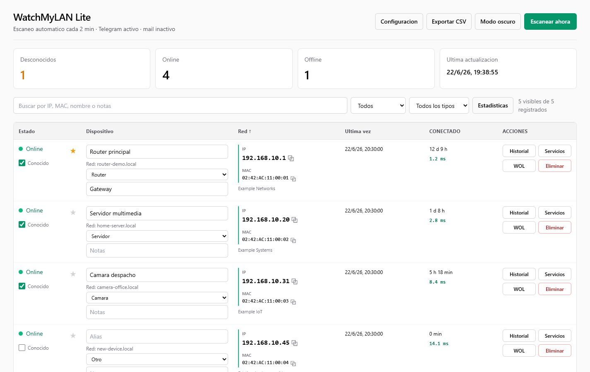
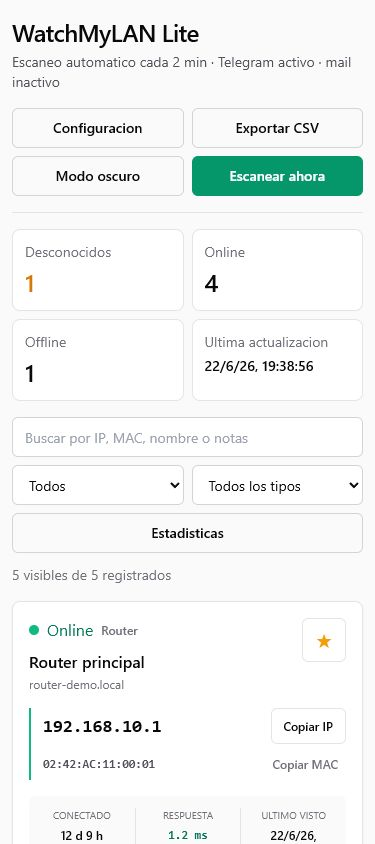
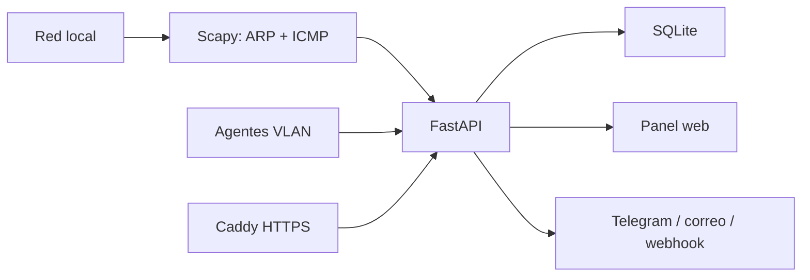

# WatchMyLAN Lite

[Español](README.md) | [English](README.en.md)

WatchMyLAN Lite es un monitor de red local autoalojado construido con FastAPI, Scapy y SQLite. Descubre dispositivos mediante ARP e ICMP, conserva el historial de conexiones, mide el tiempo de respuesta y ofrece un panel web adaptable a escritorio, tablet y móvil.



## Funciones principales

- Descubrimiento híbrido mediante ARP, ICMP y la tabla de vecinos del sistema.
- Detección automática de la interfaz activa y la subred local.
- Enriquecimiento de nombres mediante DNS inverso, mDNS, SSDP y NetBIOS.
- Estados Online y Offline con tolerancia configurable a escaneos fallidos.
- IP, MAC, hostname, nombre personalizado, fabricante OUI y tipo de dispositivo.
- Historial de conexiones, tiempo conectado y registro de cambios de IP.
- Estadísticas de latencia (media, mediana, P95 y variación), disponibilidad, estabilidad, actividad, tipos de dispositivo y rendimiento de escaneos.
- Panel de salud de red, estado del último escaneo, pausa de refresco automático y confirmación masiva de dispositivos conocidos.
- Ordenación persistente, búsqueda, filtros persistentes, filtro de atención, favoritos y exportación CSV completa o filtrada.
- Wake-on-LAN y exploración TCP opcional de servicios.
- Avisos de dispositivos nuevos desconocidos por Telegram, correo o webhook.
- Autenticación HTTP Basic opcional y HTTPS local mediante Caddy.
- Copias de seguridad automáticas de SQLite con retención configurable, descarga desde la interfaz y limpieza de dispositivos offline antiguos.
- Agentes remotos para VLAN o dominios de broadcast separados.
- Frontend de una sola página sin proceso de compilación JavaScript.

## Interfaz adaptable

En escritorio se utiliza una tabla compacta para comparar muchos dispositivos. En móvil y tablet se muestran tarjetas táctiles con IP, MAC, latencia, tiempo conectado y acciones principales sin desplazamiento horizontal.



> Las capturas utilizan una red de demostración. No contienen dispositivos ni direcciones reales.

## Arquitectura



## Tecnologías

- Backend: Python 3.12, FastAPI, SQLModel y Scapy.
- Base de datos: SQLite.
- Frontend: HTML5, Tailwind CSS mediante CDN y JavaScript vanilla.
- Despliegue: imagen Docker multietapa y Docker Compose.
- HTTPS: Caddy con autoridad certificadora interna.

## Inicio rápido con Docker

Requisitos:

- Servidor Linux conectado a la red que se quiere supervisar.
- Docker Engine 24 o posterior y Docker Compose v2.
- Usuario root o permisos para administrar Docker.

```bash
git clone https://github.com/angelrb95/WatchMyLAN-Lite.git
cd WatchMyLAN-Lite
cp .env.example .env
```

Edita `.env` e indica la IP del servidor Docker en la red local:

```dotenv
WATCHMYLAN_HOST=192.168.1.10
```

Inicia la aplicación:

```bash
docker compose up -d --build
```

Acceso:

- HTTP: `http://IP_DEL_SERVIDOR:8088`
- HTTPS: `https://IP_DEL_SERVIDOR:8443`

El certificado HTTPS lo emite la autoridad local de Caddy. El navegador mostrará un aviso hasta que se confíe en dicha autoridad desde el dispositivo cliente.

> `network_mode: host` y las capacidades `NET_RAW` y `NET_ADMIN` son obligatorias. Una red bridge de Docker no puede acceder al dominio de broadcast ARP de la red física.

Consulta la [guía completa de instalación](INSTALL.md) para Docker, Proxmox, actualizaciones, copias de seguridad, HTTPS, agentes y resolución de problemas.

## Configuración

La mayoría de opciones se pueden modificar desde **Configuración** sin reconstruir la imagen. Las variables de entorno proporcionan los valores iniciales.

| Variable | Valor inicial | Finalidad |
| --- | --- | --- |
| `WATCHMYLAN_HOST` | `localhost` | IP o nombre utilizado por HTTPS local. |
| `APP_PORT` | `8088` | Puerto HTTP de la aplicación. |
| `HTTPS_PORT` | `8443` | Puerto HTTPS de Caddy. |
| `SCAN_INTERVAL_SECONDS` | `120` | Intervalo de escaneo automático. |
| `OFFLINE_AFTER_MISSES` | `3` | Escaneos fallidos antes de marcar Offline. |
| `ARP_TIMEOUT_SECONDS` | `2` | Tiempo de espera de respuestas ARP. |
| `ARP_RETRIES` | `1` | Reintentos ARP. |
| `ARP_PASSES` | `3` | Pasadas ARP por escaneo. |
| `INCLUDE_KERNEL_NEIGHBORS` | `true` | Combinar la tabla de vecinos del host. |
| `ENABLE_PING_SWEEP` | `true` | Activar descubrimiento ICMP concurrente. |
| `PING_TIMEOUT_SECONDS` | `1` | Tiempo de espera ICMP por host. |
| `PING_WORKERS` | `128` | Concurrencia máxima solicitada para ping. |
| `TELEGRAM_URL` | vacío | Destino del bot de Telegram. |
| `SMTP_*` | vacío | Configuración de alertas por correo. |

Formato de la URL de Telegram:

```text
telegram://BOT_TOKEN@telegram?channels=CHAT_ID
```

No subas nunca `.env` al repositorio. El archivo está excluido mediante `.gitignore`.

## Alertas

Las alertas automáticas solo se envían cuando aparece una dirección MAC nunca vista y el dispositivo no está marcado como conocido. Las reconexiones y transiciones Offline normales no generan avisos.

Destinos disponibles:

- Bot de Telegram.
- Correo SMTP.
- Webhook JSON genérico, incluidos webhooks de Home Assistant.

## Descubrimiento de red

Cada escaneo combina varias fuentes:

1. ARP broadcast mediante Scapy.
2. Respuestas ICMP concurrentes y medición de latencia.
3. Tabla de vecinos Linux antes y después del barrido.
4. Asociaciones IP/MAC confirmadas anteriormente cuando responde ICMP.
5. DNS inverso, mDNS, SSDP y NetBIOS para resolver nombres.

Desde la interfaz se pueden añadir otras redes `/24` alcanzables directamente. Las redes separadas por routers, ACL de VLAN o dominios ARP diferentes necesitan un agente.

## Agentes remotos

Crea un agente en **Configuración > Agentes VLAN**. El token solo se muestra una vez. En un equipo Linux conectado al segmento remoto:

```bash
export WATCHMYLAN_SERVER=http://IP_SERVIDOR_PRINCIPAL:8088
export WATCHMYLAN_AGENT_TOKEN=TOKEN_GENERADO
export WATCHMYLAN_SUBNET=192.168.20.0/24
export WATCHMYLAN_INTERFACE=eth0
sudo -E python agent.py
```

El agente realiza el descubrimiento ARP local y envía los resultados al servidor principal utilizando su token.

## Datos y copias de seguridad

Los datos persistentes se guardan en `./data/watchmylan.db`. Docker Compose monta `./data` dentro del contenedor. Las copias manuales y automáticas se almacenan en `./data/backups` usando la API de copia online de SQLite.

No deben subirse al repositorio:

- `data/`
- `caddy-data/`
- `caddy-config/`
- `.env`

## Seguridad

- Activa la autenticación antes de exponer el panel fuera de una LAN de confianza.
- Utiliza HTTPS y confía en la CA local de Caddy en los clientes administrados.
- No publiques el puerto `8088` en Internet.
- Guarda las credenciales de Telegram, SMTP y webhooks solo en `.env` o en la base de datos de configuración.
- Rota inmediatamente cualquier credencial compartida accidentalmente en chats, registros o el historial de Git.
- La exploración TCP está desactivada inicialmente y solo debe utilizarse en redes administradas por ti.

## API

| Endpoint | Finalidad |
| --- | --- |
| `GET /api/devices` | Listar dispositivos. |
| `PUT /api/devices/{mac}` | Editar un dispositivo. |
| `DELETE /api/devices/{mac}` | Eliminar dispositivo e historial. |
| `POST /api/devices/{mac}/wake` | Enviar Wake-on-LAN. |
| `GET /api/devices/{mac}/history` | Consultar historial de conexión. |
| `POST /api/devices/{mac}/services` | Escaneo TCP opcional. |
| `POST /api/scan` | Iniciar un escaneo. |
| `GET /api/analytics` | Métricas de disponibilidad y latencia. |
| `GET/PUT /api/settings` | Consultar o modificar la configuración. |
| `GET/POST /api/backups` | Listar o crear copias de seguridad. |
| `GET/POST /api/agents` | Administrar agentes VLAN. |
| `GET /health` | Comprobar el estado del servicio. |

La documentación OpenAPI de FastAPI está disponible en `/docs`.

## Desarrollo local

```bash
python -m venv .venv
source .venv/bin/activate
pip install -r requirements.txt
sudo .venv/bin/uvicorn main:app --host 0.0.0.0 --port 8088
```

El escaneo ARP requiere Linux y permisos para sockets raw. El frontend se sirve directamente desde `static/index.html`.

## Actualización

```bash
git pull --ff-only
docker compose up -d --build
```

Las migraciones de SQLite son incrementales y conservan los datos existentes. Crea una copia de seguridad antes de actualizar.

## Estructura del proyecto

```text
.
|-- main.py                 FastAPI, escáner y API
|-- database.py             modelos SQLModel y migraciones
|-- features.py             fabricantes, descubrimiento y copias
|-- agent.py                agente remoto para VLAN
|-- static/index.html       panel web de una sola página
|-- docs/images/            capturas anonimizadas
|-- Dockerfile              imagen multietapa
|-- docker-compose.yml      despliegue con red host
|-- Caddyfile               proxy HTTPS local
|-- .env.example            plantilla de configuración segura
|-- INSTALL.md              instalación completa en español
|-- README.en.md            documentación principal en inglés
`-- INSTALL.en.md           instalación completa en inglés
```

## Consideraciones

- Algunos dispositivos bloquean ICMP intencionadamente, pero pueden seguir apareciendo Online mediante ARP.
- Las direcciones MAC privadas o aleatorias pueden no tener fabricante.
- Los gráficos históricos ganan precisión a medida que se acumulan escaneos automáticos.
- Si eliminas un dispositivo Online, volverá a descubrirse en el siguiente escaneo.
